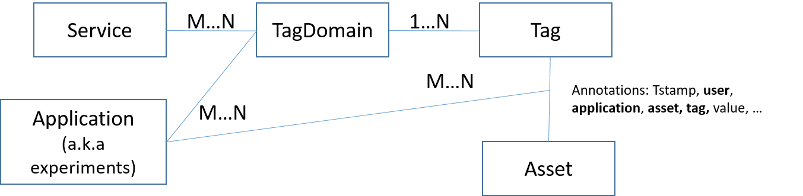

[Back to the Guidlines Overview page](https://organicityeu.github.io/).

# Asset-Annotation-Service

Data Annotation Service manages the data annotation process on assets of all Organicity sites.
The primary goal of this service is to provide to the programmable clients an available set of
tag domains and then receive and store tags (tag attachment on an asset by a user). The Organicity
platform will expose the data annotation service through the Annotation API.
 
Since the UDO is creating a new type of urban data repository and provides a starting point for exploration of 
urban data across different city environments, it is crucial to stimulate extraction and generation of knowledge from the 
raw data streams. Aiming at enhancing the urban data sources with useful information, OrganiCity has developed this service for 
enabling collaborative data annotation. The utilized data model and annotation services are flexible enough to enable various types 
of labels from online resources on the Web, social media and references to rich multimedia content online (images, video, etc.)
 to free-text labels or numeric values. A set of methods has been created for maintaining dynamic label 
 categories, labels and labelling of data.  
  
 

Acquiring labels for a specific set of data sources can be parameterized under the scope of an experiment. Experimenters can define a set 
of label categories to be used by the applications associated with their experiment. Moreover, experimenters, or other end-users, 
can retrieve the various labels and the corresponding data under the scope of an experiment.  Finally, they can create customized applications 
to acquire annotations from participants, or applications to visualize them. 
 
Along with the crowdsourcing annotation process, experimenters can utilize machine learning algorithms that enable more autonomous 
learning, semi-supervised learning or reinforcement learning techniques, exploiting the acquired annotations as training sets. 
It is possible in this way to use the created models as classifiers for automatic labelling of urban resources, events or anomaly detection. 
Furthermore, as users are constantly contributing with annotations, experimenters are possible to perform verification, cross-validation 
on the extracted models and create adaptive models using reinforcement learning methodologies. 

References to the specification of the Asset Annotation Service
- Annotation Service Endpoint: http://annotations.organicity.eu/
- Annotation Service Swagger UI: http://annotations.organicity.eu/swagger-ui.html
- Annotation Service Swagger Documentation: https://organicityeu.github.io/api/Annotation.html

## Data Model

Data Model Entities:

### Tag

    {
      "id": 0,
      "name": "string",
      "urn": "string"
    }

### TagDomain

    {
      "description": "string",
      "id": 0,
      "services": [
        {
          "description": "string",
          "id": 0,
          "urn": "string"
        }
      ],
      "tags": [
        {
          "id": 0,
          "name": "string",
          "urn": "string"
        }
      ],
      "urn": "string"
    }

Example:

    {
    id: 104,
    urn: "urn:tagDomain:td1",
    description: "description",
    tags: [
        {
        id: 106,
        urn: "urn:tag:t2",
        name: null
        },
        {
        id: 105,
        urn: "urn:tag:t1",
        name: null
        }
     ],
    services: [
        {
        id: 107,
        urn: "urn:service:s1",
        description: null
        }
     ]
    }

### Service

      {
        "description": "string",
        "id": 0,
        "urn": "string"
      }

### Application (a.k.a. Experiment)
    {
      "description": "string",
      "id": 0,
      "tagDomains": [
        {
          "description": "string",
          "id": 0,
          "services": [
            {
              "description": "string",
              "id": 0,
              "urn": "string"
            }
          ],
          "tags": [
            {
              "id": 0,
              "name": "string",
              "urn": "string"
            }
          ],
          "urn": "string"
        }
      ],
      "urn": "string"
    }

### Asset

    {
      "id": 0,
      "urn": "string"
    }

### Annotation

    {
      "annotationId": 0,
      "application": "string",
      "assetUrn": "string",
      "datetime": "string",
      "numericValue": 0,
      "tagUrn": "string",
      "textValue": "string",
      "user": "string"
    }

## Annotation Service API

Operations:
- TagDomain Management: Service, TagDomain, Tag
- Application Management: Application, TagDomain
- Annotations: Asset, Tag

User Roles:
- OC Admin (OC-A)
- OC Experimenter (OC-E)
- OC Participant (OC-P)
- OC Anonymous (OC-AN)

Restricions at Operations:
1. TagDomain Management
 + OC-A can CRUD on Service, TagDomain, Tag
 + OC-E, OC-P, OC-AN can R on Service, TagDomain, Tag
2. Application Management
 + OC-E can CRUD on Application, TagDomain
3. Annotation
 + OC-A can CRUR all Annotations
 + OC-E can CRUR all annotations of his applications
 + OC-P can CRUD only his annotations
 + OC-AN can R only COUNT aggregations of annotations

## Sample Calls
