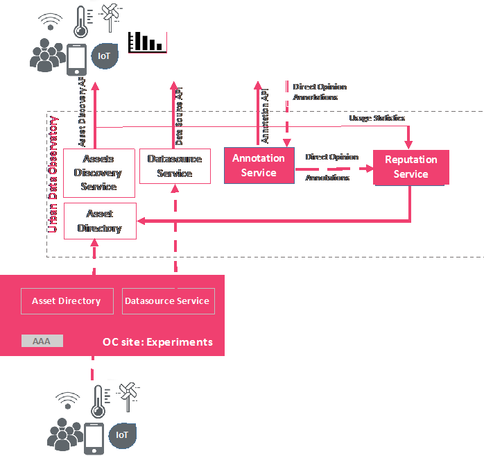

[Back to the Guidelines Overview page](https://organicityeu.github.io/).

# Asset-Annotation-Service

Data Annotation Service manages the data annotation process on assets of all Organicity sites.
The primary goal of this service is to provide to the programmable clients an available set of
tag domains and then receive and store tags (tag attachment on an asset by a user). The Organicity
platform will expose the data annotation service through the Annotation API.

Since the UDO is creating a new type of urban data repository and provides a starting point for exploration of
urban data across different city environments, it is crucial to stimulate extraction and generation of knowledge from the
raw data streams. Aiming at enhancing the urban data sources with useful information, OrganiCity has developed this service for
enabling collaborative data annotation. The utilized data model and annotation services are flexible enough to enable various types
of labels from online resources on the Web, social media and references to rich multimedia content online (images, video, etc.)
 to free-text labels or numeric values. A set of methods has been created for maintaining dynamic label
 categories, labels and labelling of data.



Acquiring labels for a specific set of data sources can be parameterized under the scope of an experiment. Experimenters can define a set
of label categories to be used by the applications associated with their experiment. Moreover, experimenters, or other end-users,
can retrieve the various labels and the corresponding data under the scope of an experiment.  Finally, they can create customized applications
to acquire annotations from participants, or applications to visualize them.

Along with the crowdsourcing annotation process, experimenters can utilize machine learning algorithms that enable more autonomous
learning, semi-supervised learning or reinforcement learning techniques, exploiting the acquired annotations as training sets.
It is possible in this way to use the created models as classifiers for automatic labelling of urban resources, events or anomaly detection.
Furthermore, as users are constantly contributing with annotations, experimenters are possible to perform verification, cross-validation
on the extracted models and create adaptive models using reinforcement learning methodologies.

References to the specification of the Asset Annotation Service
- Annotation Service Endpoint: http://annotations.organicity.eu/
- Annotation Service Swagger UI: http://annotations.organicity.eu/swagger-ui.html
- Annotation Service Swagger Documentation: https://organicityeu.github.io/api/Annotation.html

## Data Model

The underlying data model of the annotation service is depicted in the following figure.


- **Service Entities** represent utility/urban services or in general urban processes. An example of a service might be Garbage Collection, Noise Monitoring etc. The basic usage of
service entities is the organization and discovery of tag collections (e.g. what tags are usually used for characterizing the noise level sensors etc.)
- **TagDomains Entities** represent collections of tags. Usually a tag domain is associated with a service and experiment/application specify which tag domains they will use.
- **Tag Entities** represent the actual labels to be used by end-user using an annotation client (application or experiment)
- **Application Entities** (a.k.a. experiments) represent the client applications used by end-users during the annotation process.
- **Asset Entities** are the assets of Urban data observatory that are annotated (associated by user with an existing tag/label)


There are some underlying restriction and rules to Organicity users on accessing and using the annotation service. For the following Organicity roles:
User Roles:
- OC Admin (OC-A):
    - can create, read, update and delete (CRUD) Service, TagDomain, Tag, Application and Annotatation entities
- OC Experimenter (OC-E):
    - can only Read Service, TagDomain, Tag entities that are public
    - CRUD the ones involved in their experiment
    - OC-E can CRUD all annotations of his applications
- OC Participant (OC-P):
    - can only Read Service, TagDomain, Tag entities that are public
    - OC-P can CRUD only his annotations
- OC Anonymous (OC-AN)
    - OC-AN can R only COUNT aggregations of annotations

### Entity Description

The objects of the entities are comply with the following schema:

### Tag

```
{
    "id": 0,
    "name": "string",
    "urn": "string"
}
```
Example:
```
{
    id: 106,
    urn: "urn:tag:faulty",
    name: "faulty reading"
}
```

### TagDomain

```
{
"description": "string",
"id": 0,
"urn": "string",
"services": [
    {
        "description": "string",
        "id": 0,
        "urn": "string"
    }
 ],
 "tags": [
    {
    "id": 0,
       "name": "string",
       "urn": "string"
    }
 ]
}
```

Example:
```
    {
    id: 104,
    urn: "urn:tagDomain:faultyReadings",
    description: "This is tag domain to classify readings into faulty or normal",
    tags: [
        {
            id: 106,
            urn: "urn:tag:faulty",
            name: faulty reading
        },
        {
            id: 105,
            urn: "urn:tag:normal",
            name: "normal reading"
        }
     ],
    services: [
        {
            id: 107,
            urn: "urn:service:environmentalMonitoring",
            description: "environmental monitoring"
        }
     ]
    }
```
### Service
```
{
    "description": "string",
    "id": 0,
    "urn": "string"
}
```
Example:
```
{
    id: 107,
    urn: "urn:service:environmentalMonitoring",
    description: "environmental monitoring"
}
```

### Application (a.k.a. Experiment)
```
{
    "description": "string",
    "id": 0,
    "tagDomains": [
        {
          "description": "string",
          "id": 0,
          "services": [
            {
              "description": "string",
              "id": 0,
              "urn": "string"
            }
          ],
          "tags": [
            {
              "id": 0,
              "name": "string",
              "urn": "string"
            }
          ],
          "urn": "string"
        }
      ],
    "urn": "string"
}
```

### Asset

```
{
    "id": 0,
    "urn": "string"
}
```
Example:
```
{
    "id": 12 ,
    "urn": "urn:oc:entity:london:enableiot:fixed:98-4F-EE-00-0F-76"
}
```


### Annotation

```
{
    "annotationId": 0,
    "application": "string",
    "assetUrn": "string",
    "datetime": "string",
    "numericValue": 0,
    "tagUrn": "string",
    "textValue": "string",
    "user": "string"
}
```
Example:
```
{
    "annotationId": 0,
    "application": "57eab2c2ad0302ad0b5c92c6",
    "assetUrn": "urn:oc:entity:london:enableiot:fixed:98-4F-EE-00-0F-76",
    "datetime": "2016-10-21 09:01:12:123",
    "numericValue": 0,
    "tagUrn": "urn:tag:faulty",
    "textValue": "string",
    "user": "86d7edce-5092-44c0-bed8-da4beaa3fbc6"
}
```


## Annotation Service API

Operations:
- TagDomain Management: Service, TagDomain, Tag
- Application Management: Application, TagDomain
- Annotations: Asset, Tag


User Roles:
- OC Admin (OC-A)
- OC Experimenter (OC-E)
- OC Participant (OC-P)
- OC Anonymous (OC-AN)

Restricions at Operations:
1. TagDomain Management
 + OC-A can CRUD on Service, TagDomain, Tag
 + OC-E, OC-P, OC-AN can R on Service, TagDomain, Tag
2. Application Management
 + OC-E can CRUD on Application, TagDomain
3. Annotation
 + OC-A can CRUR all Annotations
 + OC-E can CRUR all annotations of his applications
 + OC-P can CRUD only his annotations
 + OC-AN can R only COUNT aggregations of annotations


## Sample Calls
