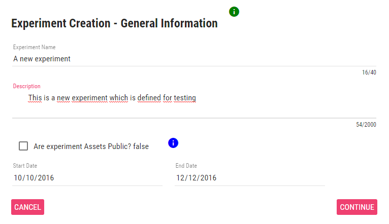
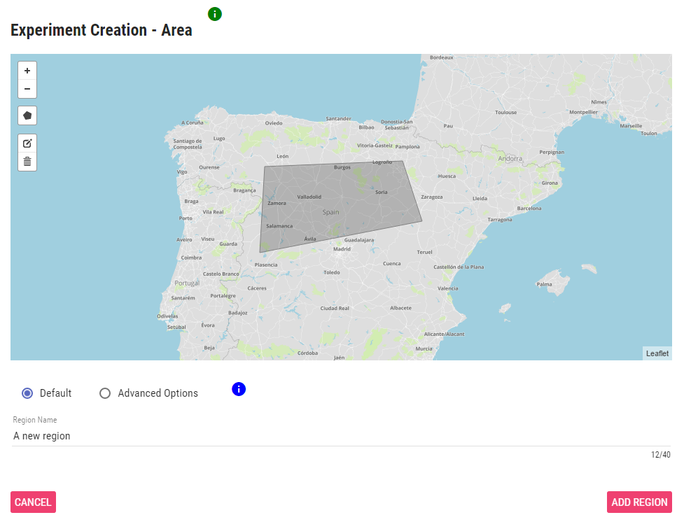

# Experimenter Portal

The Experimenter Portal (EP) provides a common interface for the experimenters to carry out several management task such as creation and modification of experiments, control of developments (i.e. applications, tools) carried out under such experiments, and monitoring the results obtained from them. In this sense, the EP enables to manage the whole lifecycle of the experiments and facilitates the interaction with other related OrganiCity functionalities. In the following we will thoroughly describe the EP by showcasing the interactions of the experimenter with the tool.

## Entering the portal
EP can be accessed through the URL http://experimenters.organicity.eu . After a successful login, the experimenter is redirected to the main page of the EP, shown in Figure 1. As can be observed, the portal provides rapid access to the different development alternatives facilitated by OrganiCity in the sidebar: links to co-creation tools, to develop new services and applications; access to documentation of tools and APIs, necessary for the experiment development; and finally, provide links to support tools, such as OrganiCity FAQ system, GitHub repository and dedicated google groups channel, devoted to provide timely support to the experimenters.

> **Figure 1:**

In the main view, it is also shown the list of current experiments indicating whether or not they are ongoing, so that the experimenter can see, at a glance, its experimentation state. As can be seen, the portal provides the option to remove experiments as well as to create new ones. When you remove an experiment, all the information related to the experiment will be lost. This will also disable the applications developed under the experiment.

## Creating new experiment
In order to create a new experiment, the portal will request general information about the experiment such as its name and description (Figure 2). It is recommended to use a catchy name and a detailed description in order to encourage people to take part on it. The experimenter also defines the time during which the experiment will be available. After that period of time the experiment cannot be used by participants, but still exist in the EP. Besides, for each experiment, it is defined the assets, or information sources, it can handle. Such assets could be public, this means that assets created by this experiment will be visible for everyone, otherwise only this experiment, and their applications, will be allowed to use them.
 
> **Figure 2:**

After providing basic information about the new experiment, the portal will request define the experiment area (Figure 3), which consisting of a set of regions where the experiment will take place. This area will be used as a first filter to select, by using some UDO functionalities, the assets used along the experiment. If you do not define an area, the experiment will be considered worldwide.
 
> **Figure 3**

## Getting detailed info about experiment
Once the experimenter selects an experiment from the list, the details of experiment is presented. Firstly, the information provided during the experiment creation process is displayed, as shown in Figure 4, allowing the portal user modify it. By this way, an experimenter might modify the experiment settings during its lifecycle: extending or limiting the area of the experiment, modifying its timespan or editing the experiment tags to better indicate its aim.
 
> **Figure 4**

## Creating new assets
In the most of cases, the experiment will include the development of some kind of application (e.g. mobile application) that will enable to participant interact with the experiment. These applications will produce information whose structure should be previously defined by the experimenter. For this end, the portal enables to create new assets by means of an editor (see Figure 5) with a twofold purpose: first to simplify the definition of new information sources by a visual tool, and secondly to provide a template and useful insight to create assets via software. As can be observed in Figure 5, during the asset edition, the experimenter will see the resulting output (JSON format) and how some of the fields are autocompleted with experiment specific information (e.g. experiment and experimenter identifiers).

> **Figure 5**

 
## Managing experiment applications
Experimenter Portal also provides the functionality to manage applications. The detailed information of the applications, such as links to download them, can be edited during the whole experiment lifecycle and will be advertised to the OrganiCity participants so as to facilitate their use. As the application is constrained to the characteristics of the experiment, the application scope is also limited by spatio-temporal dimension of the experiment, as well as by the assets that the application can use.

