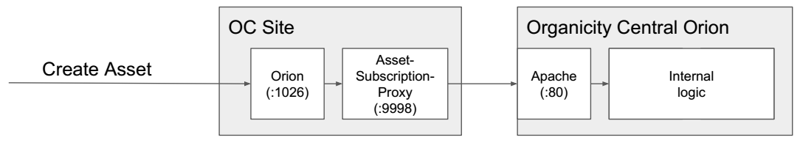

[Back to the Guidelines Overview page](https://organicityeu.github.io/).

# Tutorial: OC Site Federation - How to be an OC Site

**Goal of this tutorial**:

* Push an asset (as OC Site) to the Organicity Central Orion.

**Precondition**:

* To be able to push assets to the *Organicity Central Orion* you need a `client_id` and a `client_secret`, which has the `ocsite` role assigned.

The core component of the federation is the [Asset-Subscription-Proxy](https://github.com/OrganicityEu/Asset-Subscription-Proxy), which subscribes itself at an Orion. Thus, the Orion notifies the Asset-Subscription-Proxy about new Assets. As soon the Asset-Subscription-Proxy gets notified, it forwards the asset to the Organicity Central Orion in am authorized way. This architecture can be seen below:




## Install the Asset-Subscription-Proxy


To push assets to the Organicity Central Orion, please clone the repository of the Asset-Subscription-Proxy
 and configure it:

```
git clone git@github.com:OrganicityEu/Asset-Subscription-Proxy.git
cd Asset-Subscription-Proxy
cp config.js.example config.js
```

Next, install the Dependencies:

```
npm install
```

## Configure the Asset-Subscription-Proxy

Edit the `config.js` by applying your `client_id` and `client_secret`.

For the **Dev-Server**, make sure the following configuration is used:

```
config.asset_directory_host = 'dev.orion.organicity.eu';
config.asset_directory_port = '443';
config.asset_directory_protocol = 'https'
```

For the **Production Server**, make sure the following configuration is used:

* TODO

Afterwards, you can start the proxy:

```
node server
```

## Add Subscription to your local Orion

Edit the `config.js` by applying your Orion configuration. In this tutorial we assume, that the Orion runs on `localhost:1026`:


Thus, use the following configuration:

```
config.orion_host = 'localhost';
config.orion_port = 1026;
config.orion_protocol = 'http';
```

The default `subscription_url` is `http://localhost:<PROXY_PORT>`. If this is wrong (e.g., Orion and Asset-Subscription-Proxy run on different machines), please modify the `config.subscription_url`.

Afterwards, you can initiate the subscription:

```
node subscribe
```

If it was successful, you wll get the Subscription of your Orion:

```
Successful: /v2/subscriptions/57ea49394735cf79905858c0
```

**Hint**: Run this only once. Otherwise, you have multiple subscriptions!

## Verify subscription at your local Orion

Now you can verify your subscription:

```
GET http://localhost:1026/v2/subscriptions/57ea49394735cf79905858c0
Accept: application/json
Fiware-Service: organicity
```

## Push an Asset to your local Orion

Next step is to test the federation. Keep the log of the Asset-Subscription-Proxy open. Create an asset at your local orion, with:

* HTTP header `Fiware-Service: organicity`
* The AssetID must correspond to your Site, e.g., `urn:oc:entity:<OCSITENAME>:<AssetID>`

The local Orion should send a notification to the Asset-Subscription-Proxy, which pushes the asset to the Organicity Central Orion. You should see a message like

```
2016-09-27 06:37:05.265  - INFO: Organicity-subscription-proxy - Asset Creating: urn:oc:entity:<OCSITENAME>:<AssetID>
2016-09-27 06:37:08.303  - INFO: Organicity-subscription-proxy - Asset Created: urn:oc:entity:<OCSITENAME>:<AssetID>
```

The second line indicates, that the creation at the Organicity Central Orion was successful.
