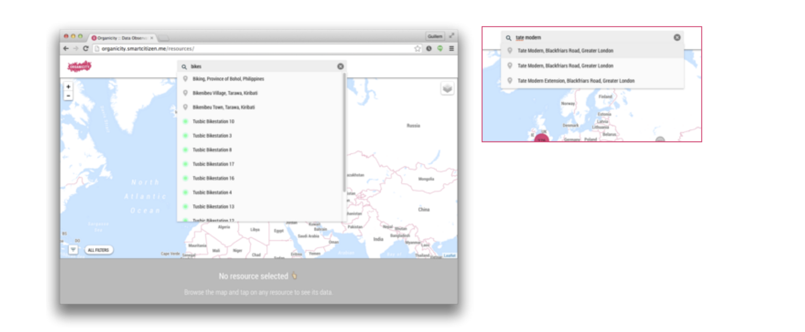

[Back to the Guidelines Overview page](https://organicityeu.github.io/).

# Urban Data Observatory

The [Urban Data Observatory](http://observatory.organicity.eu/) is the main entry point to the OrganiCity platform assets.

```
Please notice some features might be under development at the time.
```



It provides data exploration functionalities across three main interface modules: the navigation modules, involving the spatial and filter views, the text search and the assets visualization. The three modules together are designed to perform as an integrated ecosystem, supporting users on the search and understanding of useful and valuable data assets

## Navigation

The map interface provides geographical exploration of assets at multiple scales. In order to maintain a low entry barrier the interface is modelled on other existing map services the users might be familiar as Google Maps. This includes the following key features:

- Manually navigating the map by standard zoom and pan actions.
- Browsing the map by clicking at specific assets.
- Incremental search featuring simple places search.
- Client geolocation in order to center the map on to the user location.


## Search

The top search bar allows to search for assets name and metadata with auto-complete features. Results are returned based on the recommendation engine. The search offers a simplified list of the available resources that users can quickly access without any intermediate process.

On the upcoming relases this will be completed by the **Advanced search**. This allowd using information related to assets metadata, such as provider, typology or update time. The result is then shown in a permanent list format allowing users to browser the obtained results in detail.



## Assets Visualization

The Assets Visualization is designed following a system of horizontal blocks. The anatomy of the assets views contains the following sections:


### [A] Data Location: 

This module shows the geographical location of a resource on the map as described on the previous section. OC Assets always include location information as a common metadata. This can come in the form of:

- **Point:** Assets specifically geolocated as a single spot. This is indicated on the map using traditional markers.
17
- **Region:** Assets geolocated as a closed collection of points defining an area. This is indicated by using an overlay shape.
- **Path:** Assets geolocated as an open collection of points. This is indicated as an open stroke connecting all the points.

### [B] and [C] Data Visualization: 

This module is designed to support users on assets data exploration:

- **Latest data module:** This is designed as a carousel view displaying the latests data values of multiple attributes. It can work in conjunction with other data views or on its own if just latest data is available for an asset.

- **Data insights module:** This module provides historical visualization of the data by using the Data Sources API. Different view modules are developed in order to fit the visualization requirements of each datasource.

	- **Series chart module:** This is designed as a chart view capable of dealing with numeric data representation over time as the one coming from many IoT resources. The module includes date navigation options as date pickers in order to access the historical data based on its time frame. It also features the possibility of comparing two metrics simultaneously.

	- **Static data module:** This is designed as a simple, more informative view capable of dealing with unstructured resources where data cannot be processed. It offers basic information about the asset and allows the user to download the original source as a file. The file type might vary depending on the asset and support for multiple formats is planned.
	
### [D] Assets details and metadata: 

This supplies a detailed insight on the asset metadata. It provides information about the resource such as the provider, the service or the asset type, and thus supports users in getting a clear understanding about the data they are seeing.

### [E] Provider details: 

This module provides in-depth information about the provider of the asset. It is designed to give advance users as experimenters a clearer understanding of what asset they are browsing..

### [F] Comments: 

This module allows users to comment on an asset.