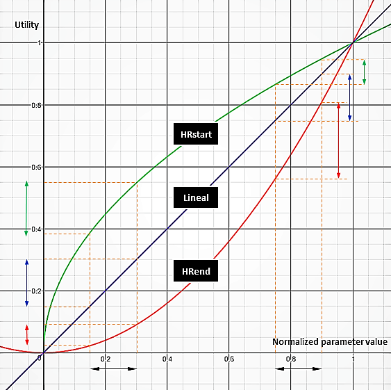

# How to Create Participation Metrics

## Introduction
Many of the activities that the participant performs within the OrganiCity platform are being tracked. This means that each time the participant uses an element of the platform, e.g., create or read assets, create or read annotations, etc., a OrganiCity component records these interactions. Using this information the experimenter could know the level of activity that each participant has within the experiment.

The measurement of each activity can generate different range of values depending of the level of interaction of the participant with each OrganiCity element. That is, at any given time, a participant could have created 100 assets and read only 10. Therefore, it is necessary to define an evaluation mechanism that allows different types of activities to be included, but, in turn, enables to standardize the contribution produced by each one within the model of evaluation. For this reason, the concept of Engagement Metric is defined using the mathematical model called utility function. This model enable the experimenter to obtain the utility of each element based on the use that the participant makes of it. For example, if a participant creates very few assets, this would mean a little utility to the experimenter.

## Metric definition

The metric is the result of a weighted sum of utility functions.

```
Metric = weight_1*function_1(parameter_1) + weight_2*function_2(parameter_2) + ...
```

`Weight`: When the experimenter includes several utility functions in the metric, could use this value to provide a greater or lesser relevance to each utility function. The sum of all weights must be equal to 1.0. If the metric have only one utility function, then this value will be 1.0.

`Utility function`: Model the utility that the experimenter wants to provide to an element of OrganiCity platform. The utility value will depend of the function assigned to each parameter by the experimenter but always will be in the range [0, 1]. “Utility functions” section describe more details about the functions that could be used.

`Parameter`: Represent the measurable element of OrganiCity platform. For now, these are the available parameters:

* `#discov-read`, number of assets read
* `#discov-create`, number of assets created
* `#annot-read`, number of annotations read
* `#annot-create`, number of annotations created

`Max`: Specify the maximum value of each parameter involved in the metric. Only parameter values that are within the range [0, max] will be taken into count for the calculation of the utility.

## Utility functions

For each utility function, the X-axis corresponds to the normalized value of the parameter to be modeled. The normalized value is calculated as a percentage of the maximum value defined for that parameter. For example, an experimenter has decided to use the #annot-create (number of annotations created) parameter within a metric, and has considered evaluating the generated utilities for a maximum of 500 annotations created. If you want to evaluate the generated utility for 150 annotations created, then you would have to use the normalized parameter value 150/500 = 0.3
The value corresponding to the Y-axis will depend on the utility function that is used. As can be seen in Figure 1, since the values of X-axis is limited within the range [0, 1], then the values of the Y-axis are also within the same range.



**Figure 1\.** Utility functions

The functions that could be used to model the utility of each parameter are the following:

* `HRstart` (High Rate start) which is based on sqrt(x) function
* `HRend` (High Rate end) which is based on x^2 function
* `Linear` which is based on linear function (y=x)

These three types of functions have been defined to model utility because they have different properties that make it easier for the experimenter to model different scenarios.

The linear function is the simplest of them. It provides the same increase in the utility value for any increase in the parameter value (see blue arrows in Figure 1). On the contrary, the HRstart and HRend functions show very interesting features. For increments of the parameter value in the lower areas of the X-axis, HRstart provides a greater increase in utility compared to HRend (see green arrows in Figure 1). However, if you look at the higher areas of the X-axis, HRend offers a greater increase in utility compared to HRstart (see red arrows in Figure 1). Depending on the scenario in which the experimenter is involved, it may be convenient to model the utility with one or another function. Below are some examples of the criteria to follow to choose a certain utility function.

## Examples of metric creation

Let's imagine that an experimenter wants to know who participants are which fed or consumed more data from OrganiCity platform when they have been using the experiment. To this end, the experimenter defines a metric using two parameters: the number of assets that each participant has created, and the number of assets consumed from the platform.

```
p1 = Number of assets created (#discov-create)
p2 = Number of assets consumed (#discov-read)
```

As part of the design criteria, the experimenter also decides to use linear functions (y = x) to model the utility of each parameter; in this way, an increase in the number of created or consumed assets will provide the same increase in the utility.

```
f1(p1) = Linear function
f2(p2) = Linear function
```

Due to the characteristics of the experiment, the experimenter also decided to use different weights for both metrics, in such a way that the number of assets consumed are more relevant than those created. To do so, the experimenter assigns a higher weight to the function corresponding to the second parameter.

```
w1 = 0.4
w2 = 0.6
```

Finally, taking into account the aforementioned design criteria, the metric would be defined as following:

```
Metric = w1 * f1(p1) + w2 * f2(p2)
Metric = 0.4 * LinearFunction(#discov-create) + 0.6 * LinearFunction(#discov-read)
```

Let’s now imagine the experimenter does not want to give more relevance to any of the utility functions corresponding to the parameters; i.e. w1 = w2 = 0.5. Instead, the experimenter decided to use different functions so that an increase in the number of assets created or consumed will generate different increases in the utility function.

In particular, the experimenter intends to encourage the participant to consume more assets, while not showing special interest in the creation of assets. For the case of the consumed assets, this means that a greater increase in the utility should be produced when the quantity of consumed assets is increasing. To accomplish this requirement, the HRend function would have to be used. On the other hand, in the case of the assets created, the increase in the utility must be the same for any value of asset created, so the linear function would have to be used.

```
f1(p1) = Linear function
f2(p2) = HRend function
```

Therefore, the new metric would be defined as follows:

```
Metric = 0.5 * LinearFunction(#discov-create) + 0.5 * HRendFunction(#discov-read)
```
