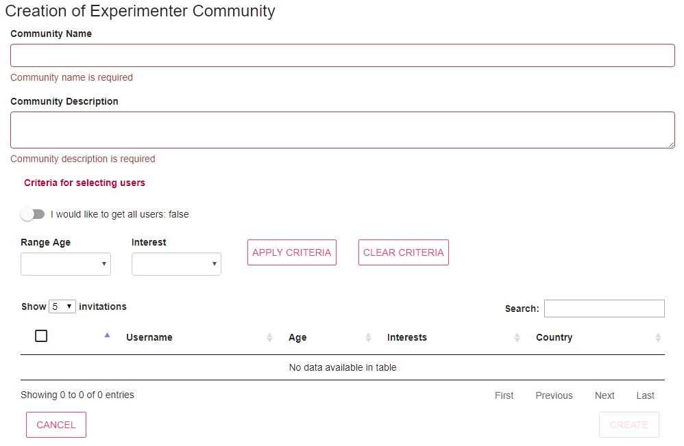

# Community Management

OrganiCity defines several types of users depending on the role assigned to them during the registration process on the OrganiCity platform. One of those roles is **participant**, which are users interested in using the experiments created by other users with experimenter role.

During the registration process on the OrganiCity platform, the participant is required to provide personal information such as date of birth, country where participant is located, gender, topics in which it is interested, etc. Using this information, the experimenter can select participants to create administrative groups called **communities**. The communities provide several functionalities, which make the interaction easier with participants.

## Entering the communities

In general, it can be accessed different types of communities depending on the roles assigned to the user. During the log in process, the Community Management detects the roles that user has and shows only the types of communities that correspond to him. In the case shown in **Figure 1**, the user has the roles of Experimenter, Site Manager and Facility Manager, so the communities corresponding to those roles are shown.

**Figure 1\.** Main view of Community Management

This documentation aims to provide support to experimenters in the use of Community Management, for that reason, the following sections will only describe the aspects of this service related to the experimenter (see **Figure 2**).

The communities created by experimenter will be used in the <a href="https://experimenters.organicity.eu/" target="_blank">Experimenter Portal</a> to send invitations to participants in order to encourage them to get involved in the experiments.

**Figure 2\.** Experimenter Community

After clicking the GO TO COMMUNITIES button, a table with the set of communities that have been created previously is shown (see **Figure 3**). Details of each community, such as the name, brief description, creation date, and the number of users that belong to the community are shown. Moreover, the experimenter can view more information about the community using the SHOW button, or remove it using the REMOVE button.

**Figure 3\.** Detail of experimenter communities

## Creating new communities

Using the NEW COMMUNITY button, the experimenter can access to the view that enable to create new communities (see **Figure 4**). 

**Figure 4\.** Creating new communities

First, it is needed to specify the name of the community and a brief description of the purpose for which the community is created. Then, it must select the participants that belong to the community. Using the on/off button, you can obtain all the participants that are registered in the platform or obtain only those that meet the criteria specified by the boxes of **Age range** and/or **Interests**. Participants obtained by any of the above methods will be shown in the table below, in which all or some of them may be selected using the selection box located on the left side of each row. Once all fields are filled in, the CREATE button will be automatically enabled to allow the creation of the community.

 
