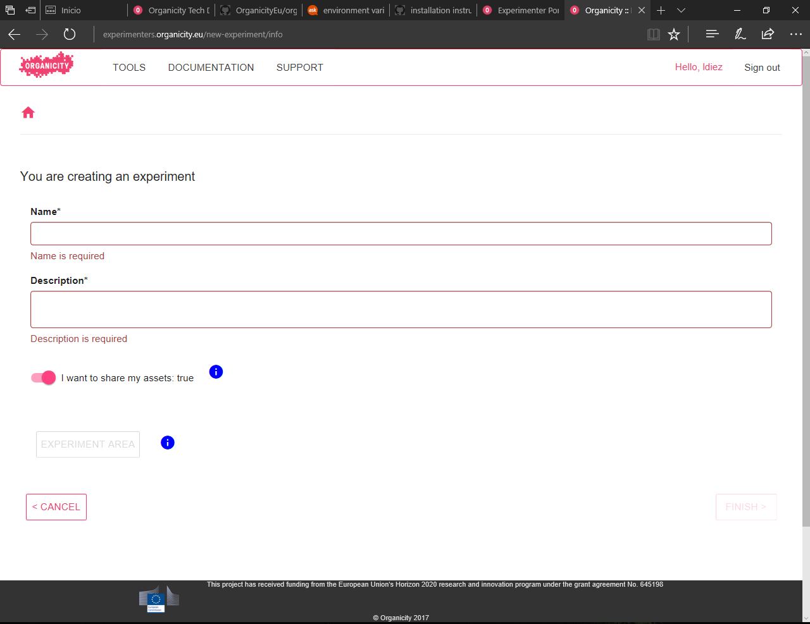
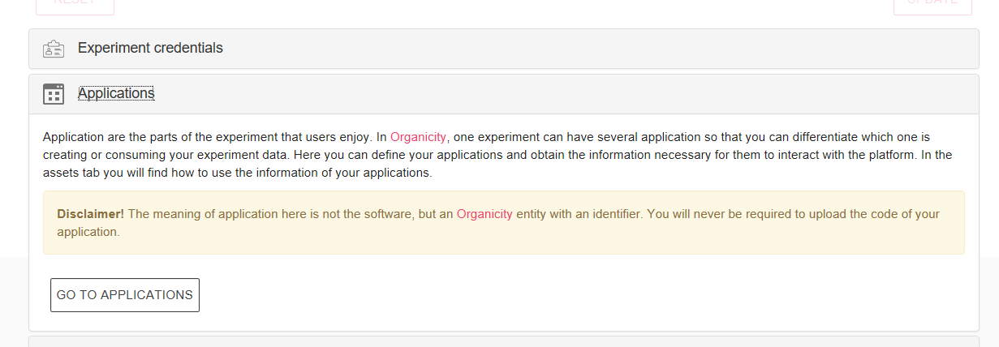
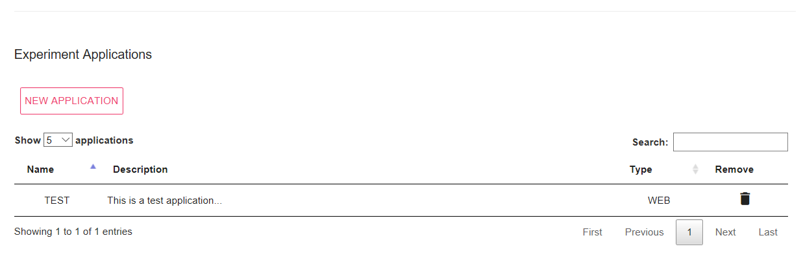

# Experimenter Portal

The Experimenter Portal provides a common interface for the experimenters to carry out experiment management and to start the interaction of your experiment with different services (e.g. annotations, authorization, etc.). An experiment can be seen as a entity that allows you to interact with the Organicity facility. Besides, within an experiment you can defined a number of applications, also entities, so that when you create assets you have to indicate which application of which experiment has created it. It is worth highlighting that an Organicity application refers just to the entity (an identifier), that will be afterwards used in *real* applications (such as smartphone applications) to enable the interaction with Organicity,

In the following the features of the Experimenter Portal are desbried in a comprehensive way.

First you need to log into the the portal (http://experimenters.organicity.eu/). In case you do not manage to perform the login, contact the facility managers through [helpdesk@organicity.eu](mailto:helpdesk@organicity.eu) to obtain proper credentials.

When you enter the portal for the same time, you will find an empty table and a button to create a new experiment. Besides, from the header you may navigate to different services and tools of Organicity; we do not detail each service and tool here, go [Home](/index) for more information. Once you have created experiments, you will see something similar to Figure 1, when the experiment name, descriptions and current state is indicated.

**Figure 1:** Main view of the Experimenter Portal

Before going step-by-step for the creation of experiments, we are listing the different features of the experiment that can be managed through the experimenter portal, that will be afterwards explained in detail in the following sections. When you enter the experiement, by clicking it, you will see something similar to Figure 2. First you can see a set of identifiers:

* Main experiment ID: it is the identifier of the experimenter who created the experiment. You will need it to create assets as described in [How To Push An Asset To The Experimenters Site](/HowToPushAnAssetToTheExperimenterSite)
* Current experimenter ID: it is your ID as experimenter, if you created the experiment is will be the same as the previous one
* Experiment ID: it is the identifier of your experiment. Again, you will need it to create assets, see [How To Push An Asset To The Experimenters Site](/HowToPushAnAssetToTheExperimenterSite)

Afterwards, you can see your experiment name, description and the options to make the experiment assets public, more about this in section _**Create and edit experiments**_. Finally you can see the list of features to be managed: 

**Figure 2:** Overall experiment view: experiment features managed through the Experimenter Portal

* Experiment Credentials: this allows to get the experiment to obtain and manage permissions to interact with Organicity from your experiment.
* Applications: as mentioned before, Organicity applications are entities (identifiers) that map onto real applications, so that you can identifify how the applications interact with Organicity.
* Assets: these are the pieces of information created by your experiment (by their applications)
* Annotations: you annotate you assets, by defining tags, in order to enrich their information
* Experiment Team: you can add other experimenters to your experiment, so that they will see the same as you.
* Participants: this feature allows you to contact people registered within Organicity to engage them into your experiment

## [A] Create and edit experiments

As can be seen in the figure below, an experiment can be created by just defining:

* Name: Name of the experiment
* Description: meaningful and catchy description of the experiment. This description will be used if you decide to invite people to participate in your experiment
* Assets privacy: choose whether or not you want your asstes to be public or private. Note that by doing them private only your experiment will be able to access their data.

Besides, if it is necessary you may also define the experiment area, by clinking **EXPERIMENT AREA**. The area is made of regions, that in turn is defined as a polygon with a name, as depicted belor. You can define as many regions you want for your experiment.

Once you are done, click **FINISH** to complete the experiment creation.

**Figure 3:** Form to create a new experiment

You can also edit the experiment information from the view of the experiment (Figure 2), by simple modifying the name or description and clicking **UPDATE**.

## [B] Experiment Credentials

When you create an experiment a new *client* is created for that experiment under the hood. 
You may use that client to implement authorization in the applications within the experiment, see [How To Authenticate An User](/HowToAuthenticateAnUser).

**Figure 4:** Experiment credentials view

From that client, you can define and edit *redirect_uris* as you need.

## [C] Create and edit applications

As mentioned before, to create assets, an experiment does not suffice, but the assets are created by application within your experiment. T
To create an applciation just go to the **Applications** section of you experiment, as shown in Figure 5. It moves you to the view of applications of your experiment. 
As you can see in Figure 6, the applications view resembles the experiments view in Figure 1, and you can have as many applications as you need within your experiment.

**Figure 5:** Applications menu from main experiment view

**Figure 6:** Experiment applications view

If you click **NEW APPLICATION**, you will get a view as shown in Figure 7, in which you have to fill in a form for the application very much like the one to create 
an experiment. Remember that you can click the blue information buttons for guidance.

**Figure 7:** New application form

## [D] Manage assets

Based on the interface provided by the [AssetDiscoveryService](/AssetDiscoveryService), through Experimenter Portal you can see the list of assets created within 
your experiment, as depicted in Figure 8. You can also create new assets using its graphical editor or even modify existing ones.

**Figure 8:** Main view of assets management

If you click **ADD ASSET** you will see a graphical editor to edit the JSON of your asset with some minimal information pre-filled. You can obtain more information
regarding the asset data model [HERE](/AssetDataModel), you can also edit existing assets by just clicking over them in the table shows in Figure 8. 
Keep in mind that this editor is just a minimal tool that uses [HowToPushAnAssetToTheExperimenterSite](/HowToPushAnAssetToTheExperimenterSite) and 
[HowToUpdateDeteleAnAsset](/HowToUpdateDeteleAnAsset)

## [E] Annotations
Experimenter Portal interacts with Annotation Service to simplify the creation of tags. 
The explanation of this feature can be found [here](/annotations/tutorials/HowToCreateAnnotationTags/). From the annotations section of your experiment you can both
create specific tag domains for your experiment or select existing generic domains to be used by your experiment. For the tag domains you create, you can define your 
own tags. Besides, when you enter this section just after creating the experiment, you will notice that a default experiment tag domain has been created.

**Figure 9:** View of assets annotations

## [F] Experiment area
At any time, you can define or edit the area of your experiment by adding, deleting or modifying the experiment regions. It is fairly intuitive and the blue 
information symbols will guide you.

**Figure 10:** Main view of the Experimenter Portal

## [G] Experiment team

As simple as it looks, you can add experimenter to your experiment team by selecting them and clicking **UPDATE TEAM**. 
The table will show the user names of all the experimenters registered in Organicity. 
Note that once an experimenter is part of the experiment team they get access so identifiers and credentials, so ensure that you are inviting the right person.

**Figure 11:** Experiment team

## [H] Participants
To be completed.