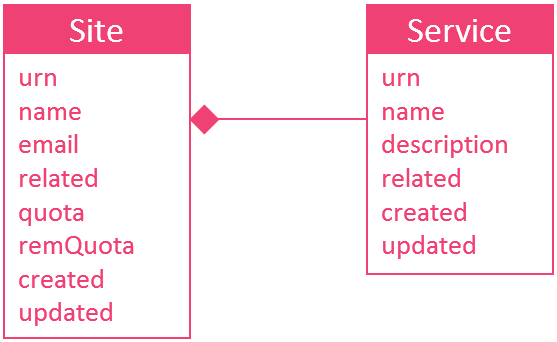

# Facility Manager

## Introduction

In the OC Platform, all the assets belong to sites. Some of them are federated OC Sites (Aarhus, London, Santander, and more to come), and some others are related to more logical aggregate. For example, the OC Experimenters Site manages data generated during experiments and the OC Provider Site manages the data provided by OrganiCitizens themselves.

A Service represents utility/urban services (e.g. Garbage Collection, Noise Monitoring, etc.). It always belongs to one and only one OC Site.

## Facility Manager website

A dedicated website is available for creating, removing and editing sites and services. It's available with the following URL: <https://facilitymanager.organicity.eu> 

Under the site section, a webpage lists all the available sites. If you are a platform administrator, a green button is displayed for creating a new site.

For each site, a dedicated webpage gives advanced informations.

 If you are a platform administrator or an administrator for the considered site, you can also:

 * edit the site information
 * edit/create/remove the services 
 * see the site credentials and services credentials

## API

For integrating site informations into another application, an API is available. It's described in a swagger document available at <https://facilitymanager.organicity.eu/api/index.html>

