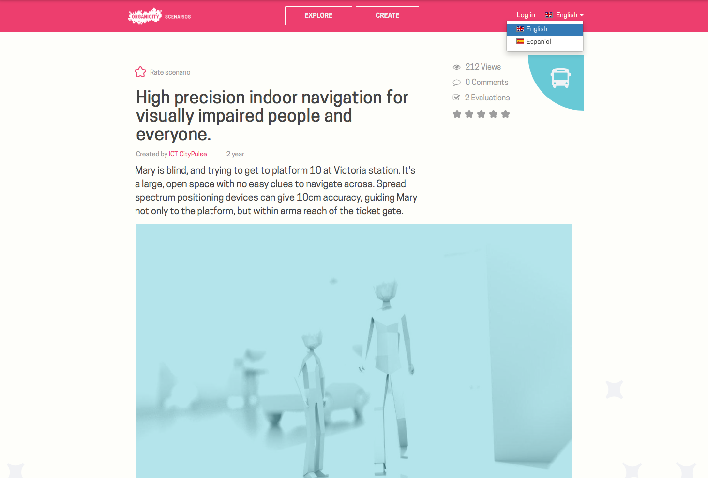
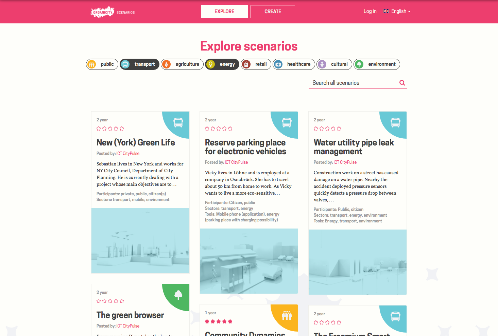
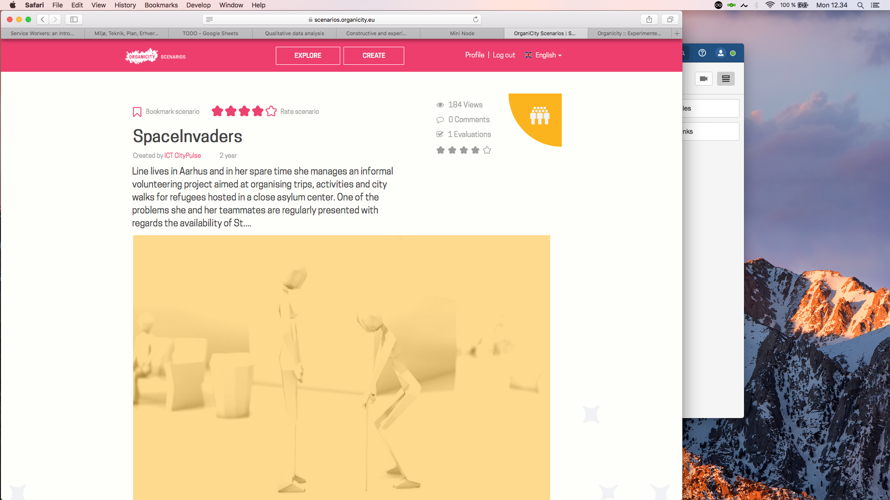
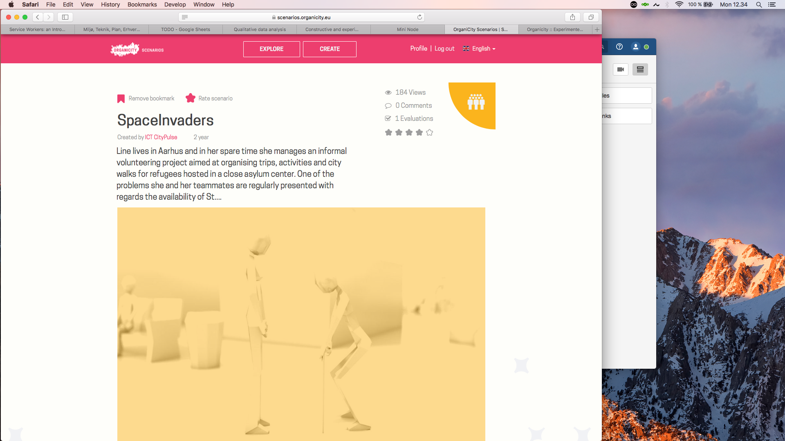
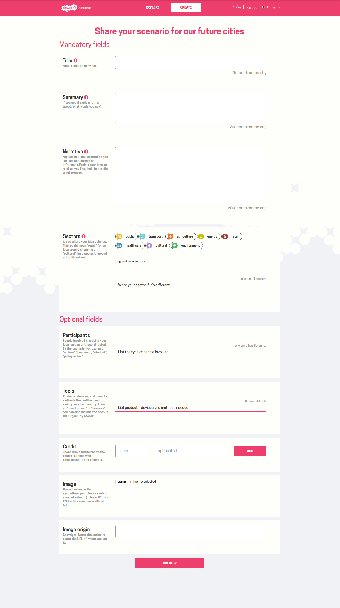

# Scenarios

## Introduction

The scenario tool has been developed through the vision of capturing citizens' ideas about their cities. The overall aim is to make anyone able to create their own vison of how a smart city could look like, by descibing a specific future situation, service, product or something completely different, that they imagine would become part of their city. The scenario tool is basically a repository of future stories told by ordinary citiznes and the people involved in the OrganiCity project. Become part of the tool by contributing your future ideas.

## Scenario tool walk-through

This section will go over how to interact with the tool from an end-user perspective. It is possible to grab the source code, and make your own scenario tool or repurpose it for use in an other context. Additionally, you can interact with the scenario tool through our REST api. These more technical features can be explored by going to the ver last section of this tutorial "Technical background and use".

The scenario tool is available here: https://scenarios.organicity.eu

### The landing page

When entering the website for the first time you will be presented with an overview of the eight types of scenarios available, and how many have been generated under each type. Additionally, there is an overview of the latest added scenarios (see picture below).

It is possible to select between english and spanish, when traversing the website. A specific scenario has been written in the language prefered by the author, and will therefore not be changed when changing the language of the website! the below picture shows how to change language:

### Exploring scenarios

When pressing the "explore" button at the top of the webpage, you will be refered to a page that resembles the landing page. The difference is that, it is now possible to browse through all available scenarios, and there is a filtering mechanism for simplifying search. The below picture shows how the explore page looks like.

If no filtering has been applied, you can simply scroll your way trough all the scenarios. This can be quite combersome as the repository grows, and as a result we have added filtering that will reduce the scrollable list significantly. Filtering can through rtext searching and / or by by clicking on the types of interest. In the below picture "transport" and "energy" has been selected as the two types of interest. The list of relevant scenarios will automatically change according to what filtering has been applied.

### Selecting a specific scenario

when you have browsed the scenarios, and finally found one of interest, you simply click on it, and you will be directed to an elaborated page. In the below picture a specific scenario has been selected, and it now becomes possible to read the full scenario, see a star rating, evaluate the scenario, see how many has viewed it and how many comments it has gotten.

Rating a scenario is done by hovering the mouse marker over the star at the top left corner of the page. The star expands into five stars, and you simply move the cursor to the number of stars you would like the scenario to have, and lick the mouse button. You can always change your mind and redu the rating at a later stage.

It is also possible to bookmark a scenario for later reference (the list of bookmarked scenarios can be found under your profile). Bookmarking happens much the same way as with star rating. You move the mouse cursor to the bookmark icon at the top left of the webpage, and click. When the icon becomes filled it is saved. You can remove the bookmark simply by clicking once more at the icon, so that it becomes transparetn again.

### Create a scenario

At some point you might have been so entrigued that you decide to contribute your own scenario. In order to do this, you simply click "CREATE" at the very top of the webpage. First you will be required to create a new user if you don't have onw already. When the user creation is finished, you will be refered to a page that looks like the picture below:

You are presented with an elaborate form that needs to be filled out. We have provided helping text for understanding what needs to be filled in each of the boxes. When you have finished filling out the form click "PREVIEW", and you will be ready to publish the scenario to the broad public.

### My profile

The very last part of traversing the scenario tool is to look at your profile page (see picture below). Here you can update your information, see a list of the secnarios you have contributed, and a list of your bookmarked scenarios

That's it! You now now everything that is worth knowing about the scenario tool, from an end-user perspective. If you are interested in knowing what is under the hood of the tool, we have both the source code publicly available on Github, and we have a REST api. In the following section we will point you to the relevant locations.

## Technical background and use

The Scenario tool is completely open source, and can be repurposed for any use. The code base is available at Github, and can be found here: https://github.com/OrganicityEu-Platform/scenarios

If you would like to interact programmatically with the Scenario tool (e.g. extract all available scenarios), then you can simply leverage the existing REST api, which can be found here: https://organicityeu.github.io/api/Scenarios.html
