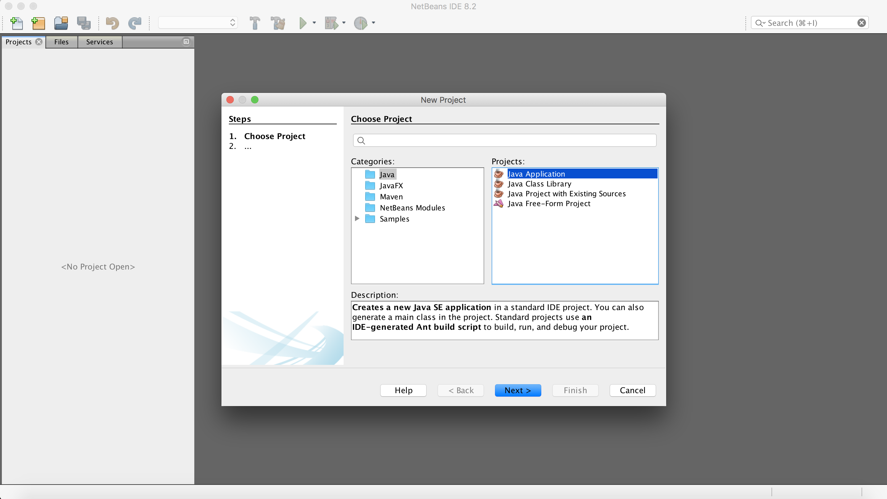
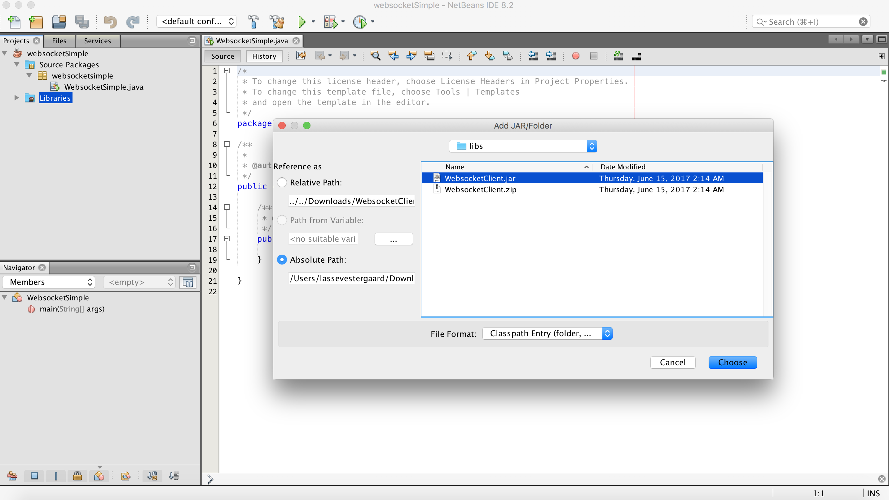

# Websockets

## Introduction

This tool has been made available in order to provide real-time updates from assets in theOrganiCity platform. As an example, I might want to get a notification if the lights suddenly turns on in my office. By having e.g. a smartphone application that is using the websockets tool, it becomes possible to listen for updates coming directly from the office (provided that the office's light source is registerede as an asset in the OrganiCity platform). More generally, this tool creates a websocket client for connecting with the OrganiCity platform, and subscribe to updates on assets already registered on the platform.

## Installation

In order to make this tool work one would need to be working in a Java environment, and it is therefore a prerequisite that a java IDE is installed. Otherwise, the installation is quite simple.

1. Go to this Github page and download the project as a zip file: https://github.com/OrganicityEu/WebsocketClient
2. Unzip the file locally
3. You can either open the entire websockets project as a maven project in your favourite java IDE or simply import WebsocketsClient/libs/WebsocketClient.jar as an external jar into your existing project

That is it! In the following section, we will provide a concrete usage example on how to import the websocket tool as an external jar into a new java project.

## Usage example

This section provides a simple example on how to use the websocket tool, and we will be using Netbeans as the java IDE. The specific example shows how to subscribe to a single asset already created in the OrganiCity platform (it is not possible to subscribe to more than one asset at a time, and it is not possible to subscribe to creation or deletion of a new asset).

### Start Netbeans and create a new empty java project

The below screenshots show the steps of creating a simple java application




When the java project has been created it is time to import the websocket connection

### Add WebsocketsClient.jar as external jar

The below screenshots show how to add an external jar to an existing java project.

First you need to right-click on the "Libraries" folder and select "Add Jar/Folder..."


Then you have to browse to where you unzipped the file from Github (see Installation section), select teh file named "WebsocketClient.jar", and finally click "Choose".



That's it. The library has now been imported and can be leveraged in your project. In order to test the websocket functionality it is required to have an existing asset. If you don't have an existing asset, then read the next section. Otherwise, you can skip this section and jump directly to "Get authentication token".

### Adding an asset (can be omitted if there is already an asset available)

This task can only be performed if you are a registered OrganiCity experimenter! In order to become an experimenter go to this website https://experimenters.organicity.eu, and click "Sign in" (even if you don't have a user yet - you can create one).

You create a new asset by following this the steps in this link: http://organicityeu.github.io/HowToPushAnAssetToTheExperimenterSite/#tutorial-how-to-push-an-assets-to-the-organicity-experimenter-site

When the asset has been created, the next step is authentication.

### Get authentication token

In order to be able to actually subscribe to a specific asset you need an anthentication token (a proof that you actually have the rights to get the information from the asset). This can be quite tricky, but we have created a tutorial on how to get the token: http://organicityeu.github.io/HowToAuthenticateAnUser/

You can either follow the steps directly from top to bottom or you can scroll all the way to the bottom of the tutorial and leverage existing libraries which might reduce some of your complexity.

When you have generated the authentication token it is time write some code.

### Coding example

Below is a code snippet showing how to subscribe to a specific asset with an entity id, and an authentication token (both are not real, and can't be used). The specific code is not of any great use in a real setting, since it just performs a new subscription, and then deletes it five seconds later. The only purpose of the example is to show how to both subscribe and unsubscribe.

The most important line of code is ```OrionSubscription subscription = new OrionSubscription(cond, attr, "P1D", entityId, false, "urn:oc:entityType:userImage",null,token);```

Each of the parameters are described in the table below

| Parameter    | Description                                    | Value       | Type     | Additional info | 
| ------------ | ---------------------------------------------- |-----------  | -------- | --------------- |
| conditions   | Defines the "trigger" for the subscription     | Can be null | String[] |                 |
| attributes   | Define the "triggering attributes"             | Can be null | String[] |                 |
| duration     | when the subscription expires                  | Need value  | String   | More on formats: https://en.wikipedia.org/wiki/ISO_8601 |
| id           | Id of the asset you want to subscribe to       | Need value  | String   |                 |
| isPattern    | Indicate whether the subscription is a pattern | Need value  | Boolean  | More on patterns: https://fiware-orion.readthedocs.io/en/develop/user/walkthrough_apiv2/index.html#getting-all-entities-and-filtering |
| type         | Type of an asset entity                        | Need value  | String   |                 |
| subscriberId | Id of the subscriber                           | Can be null | String   |                 |
| token        | The token accuired in the previous step        | Need value  | String   |                 |

Additional parameter descriptions can be found here: https://fiware-orion.readthedocs.io/en/develop/user/walkthrough_apiv2/index.html#subscriptions

Below is an example of a valid asset:

```
{
  "id": "urn:oc:entity:experimenters:5a660d96-0ef7-42ca-9f6c-5dbb86d6aa20:58ab32f36f8b513746565c54:wsasset",
  "type": "urn:oc:entityType:userImage",
  "TimeInstant": {
    "type": "urn:oc:attributeType:ISO8601",
    "value": "2016-10-04T13:45:00.000Z",
    "metadata": {}
  },
  "comments": {
    "type": "urn:oc:attributeType:text:string",
    "value": "hello",
    "metadata": {}
  },
  "user": {
    "type": "urn:oc:attributeType:text:string",
    "value": "world",
    "metadata": {}
  }
}
```

And now the actual code :-)

```
import java.util.List;
import dk.alexandra.orion.websocket.transports.OrionSubscription;
import websockets.WebsocketClientStomp;
import websockets.handlers.WebsocketCallback;

public class VanillaTestClient implements WebsocketCallback{
  
  WebsocketClientStomp wsc;
  long now;
  boolean hasSubscription = false;
  
  
  public VanillaTestClient(){
    now = System.currentTimeMillis();
    wsc= new WebsocketClientStomp(this, "ws://31.200.243.76:8090/orion");
    startLoop();
  }
  
  private void startLoop(){
    while(true){
      if(System.currentTimeMillis()>now+5000){
        if(!hasSubscription){
	  //example of how to create a subscription
	  String[] attr = new String[1];
	  attr[0] = "comments";
	  String[] cond = new String[1];
	  cond[0] = "comments";
	  
	  String entityId = "<Your asset id here here>";
	  String token = "<Your token here>";
	
	  OrionSubscription subscription = new OrionSubscription(cond, attr, "P1D", entityId, false, "urn:oc:entityType:userImage",null,token);
					  
	  System.out.println("trying to set subscrition");
	  hasSubscription = wsc.registerSubscription(subscription);

          if(hasSubscription){
            System.out.println("subscription set");
          }  
        }else{
          List<String> subscriptions = wsc.getSubscriptions();
          if(subscriptions.size()>0){
            if(wsc.unregisterSubscription(subscriptions.get(0))){
              hasSubscription=false;  
            }
          }
        }
        
        now = System.currentTimeMillis();
      }
    }
  }
  
  @Override
  public void messageReceived(String mesg) {
    System.out.println("Received message in Processing "+mesg);
  }
  
  
  public static void main(String[] args){
    System.out.println("Starting Vanilla test client");
    VanillaTestClient client = new VanillaTestClient();
  }
}
```

If everything went as expected, then you have now made your first subscriptioon to the OrganiCity platform, and you are ready to make your application truely responsive to changes within OrganiCity.

## Technical background

The OrganiCity platform is built around the Orion Context Broker (https://fiware-orion.readthedocs.io/en/master/), and the websockets tool conform to the abilities and formats dictated by the context broker. As the Context Broker is REST based, we provide a Spring.io based middleware (https://github.com/OrganicityEu-Platform/WebsocketMiddleware) for transforming the connections between REST and Websockets.

For further technical and code detail, please take a look here: https://github.com/OrganicityEu/WebsocketClient

reference: https://fiware-orion.readthedocs.io/en/develop/user/walkthrough_apiv2/index.html#subscriptions

Look there to acquire token: https://github.com/OrganicityEu/organicityeu.github.io/blob/mkdocs/docs/HowToAuthenticateAnUser.md


## Known issues

When running the example code directly from within your IDE (e.g. Eclipse or Netbeans) it seems that the java process will not close down when stopping the application. It will only shut down properly if you run the application as debug. If you run the example from the commandline (as the final application outside of the IDE) then there should be no problems - it should all be working as expected, and all related java processe will clode down correctly.
